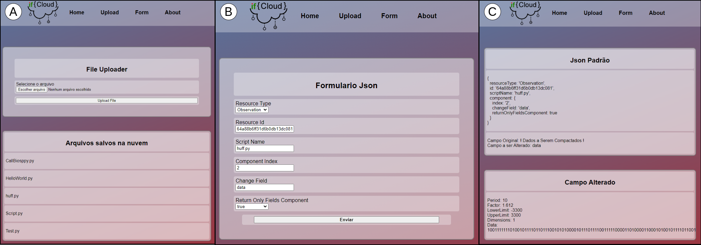

# Projeto IF-Cloud
  


A Figura ilustra a visão  geral do ecossistema de saúde digital para monitoramento contínuo de biossinais com troca de recursos no padrão FHIR. As funcionalidades das APIs em nuvem para suportar projetos IoT e aplicações web de biossinais podem ser resumidas em CRUD (Criar/Ler/Atualizar/Excluir ) e Processamento. **IF-Cloud** - *API FHIR para Integração de projetos de saúde digital* - compõe o ecossistema como API de processamento.

IF-Cloud auomatiza a execução de scripts Python que tem upload realizado por meio de uma interface gráfica. IF-Cloud utiliza os dados dos recursos FHIR provenientes da API de CRUD [FASSECG](https://github.com/if4health/FASS-ECG) e retorna um outro recurso FHIR com os dados processados pelos scripts. Ou seja, IF-Cloud permite a inclusão de novas funcionalidades em ecossistemas de saúde digital mediante um upload de arquivos de script.


## Requisitos
- NodeJS [https://nodejs.org/en/](https://nodejs.org/en/)
- Python [https://www.python.org/](https://www.python.org/)
- Pip - O gerenciador de pacotes do Python.
- Git - Para clonar o repositório.
- Aplicação IF-Cloud (este repositório)
- FASSECG [https://github.com/if4health/FASS-ECG](https://github.com/if4health/FASS-ECG) 


IF-Cloud depende de uma API FHIR com operações CRUD para fornecer os dados a serem processados, pois não tem banco de dados. Alternativamente, IF-Cloud também pode utilizar recursos FHIR da API pública de testes [HAPI FHIR](https://hapi.fhir.org/baseR4/swagger-ui/).


## Instalação
1. Faca download deste repositorio
```sh
git clone https://github.com/if4health/ifcloud .
```
2. Configure variáveis de ambiente:

Na pasta raiz do projeto, temos um arquivo `.env.example`. Você deve renomear este arquivo para `.env` e seguir as instruções abaixo:
| Rota | Descrição |
|------|-----------|
| `PORT` | Porta na qual a aplicação irá rodar |
| `FASSECG_API_URL` | Url da API de CRUD FASSECG |
| `API_URL=http://localhost:{PORT}/ifcloud` | Altere o `PORT` para a porta no qual `ifcloud` está rodando |


3. Instale as dependencias de NodeJS para este projeto 
```sh
npm install
```

4. Instale as dependencias de Python para este projeto 
```sh
pip install -r requirements.txt
```


## Utilização
Após instalar todas as dependências, você pode iniciar a aplicação com:
```sh
npm start
```
Visualize o IF-Cloud rodando no navegador:
```sh
http://localhost:{PORTA_ESCOLHIDA}/ifcloud/home
```

**JSON de Configuração** de IF-Cloud para fins de controle do fluxo de dados da interface e da automação dos scripts Python.

```json
{
    "resourceType": "Observation",
    "id": ":id_from_FASSECG_API",
    "scriptName": "calcBPM.py",
    "component":
    {
        "index": "0",
        "changeField": "data",
        "returnOnlyFieldsComponent": true
    }
}
```

- `resourceType` - tipo de Recurso FHIR que IF-Cloud deverá buscar na API de CRUD;
- `id` - identificador do Recurso FHIR que a aplicação deverá buscar na API de CRUD;
- `scriptName` - nome do script disponível no diretório Python SRC a ser executado.
- `component` - Configura a chave do Recurso FHIR que será buscado, alterado ou retornado pelo script configurado em `scriptName`.
    - `index` - índice da chave `changeField` a ser alterado no Recurso FHIR;
	- `changeField` - determina qual a chave do Recurso FHIR deverá ser alterada;
    - `returnOnlyFieldsComponent` - se IF-Cloud irá retornar somente os campos alterados ou todo o Recurso FHIR para o solicitante.
	




Para facilitar a utilização, IF-Cloud disponibiliza uma interface de usuário.
- **Item (A)** - Ao selecionar um script em python para fazer upload em IF-Cloud (menu Upload), ele fica salvo em uma lista de scipts disponiveis e pode ser executado a qualquer momento.
- **Item (B)** - Uma das formas de carregar o JSON de configuração de IF-Cloud é clicando no menu Form da UI e preenchendo o formulário.
- **Item (C)** - Ao enviar o formulário, IF-Cloud executa o script selecionado e redireciona uma página informativa mostrando o resultado da execucao do script conforme as configurações do JSON de configuração.


## Rotas

IF-Cloud oferece duas categorias de rotas na chamada dos scripts carregados na nuvem. 

A chamada por **rota direta** é indicada para testes de funcionamento do próprio script pelo usuário/desenvolvedor. Esta abordagem não tem acesso aos recursos da API de CRUD e também não gera recursos FHIR, pois IF-Cloud faz apenas a execução de um script Python disponível no diretório. 

A chamada na **rota principal** é o método de execução dos scripts cuja resposta pode ser retornada em um recurso FHIR. Sempre que IF-Cloud receber uma requisição na rota principal, é necessário buscar os dados salvos na API de CRUD para serem sobrescritos com processamento intermediado pelos scripts salvos em IF-Cloud. 

 
| Rota                         | Método | Descrição                                                                                                      | Exemplo |
|------------------------------|--------|----------------------------------------------------------------------------------------------------------------|---------|
| `/run_script/direct/params`  | POST   | Executa um script salvo em IF-Cloud com parâmetros de entrada.                                                 | Veja abaixo |
| `/run_script/direct/HelloWorld.py` | GET | Executa o script `HelloWorld.py` salvo em IF-Cloud para testar se a aplicação foi instalada corretamente. Não precisa de parâmetros. | N/A     |
| `/run_script/operation`      | POST   | IF-Cloud executa um script de acordo com o **JSON de configuração** e modifica o conteúdo de uma chave de um recurso FHIR proveniente da API de CRUD `$(FASSECG)`. | Veja documentação |

### Exemplo de chamada para `/run_script/direct/params`

```json
{
  "scriptName": "calcBPM.py",
  "params": "949.0 948.0 950.0 950.0 951.0 977.0 977.0 975.0 978.0 978.0 979.0 976.0"
}
```


## Casos de teste

Para mostrar as possibilidades de IF-Cloud, nós coletamos um trecho de um eletrocardiograma (ECG) do [PhysioNet](https://physionet.org/), um repositório de dados médicos disponíveis gratuitamente.

O diretório `testfiles` contém o seguinte material para iniciantes no IF-Cloud: 
```sh
├── calcBPM.py
├── config-ifcloud.json
├── FHIR-Observation-1-lead-ECG-snippet.json
├── HelloWorld.py
└── params-route-direct.json
```

1. O arquivo `FHIR-Observation-1-lead-ECG-snippet.json` contém um trecho de um ECG de uma derivação descrito como um recurso FHIR Observation para ser inserido em `$(FASSECG)`.
2. O script `HelloWorld.py` serve para você testar a implantação de IF-cloud na nuvem ou no localhost na rota `GET $(URL_IFCLOUD)/run_script/direct/HelloWorld.py`
3. O script `calcBPM.py` realiza o cálculo da frequência cardíaca de um determinado ECG. **Entrada**: Derivações do ECG no formato de string: `. **Saída**: Um array com os dados processados pelo script.
4. Utilize `params-route-direct.json` no corpo da requisição `POST $(URL_IFCLOUD)/run_script/direct/params` que IF-Cloud vai retornar o vetor de BPMs do ECG
5. Utilize `config-ifcloud.json` no corpo da requisição `POST $(URL_IFCLOUD)/run_script/operation` que IF-Cloud vai retornar o vetor de BPMs do ECG descrito como um FHIR Observation. 
	- Não esqueça de substituir `:id_from_FASSECG_API` pelo ID que a API FHIR responder após o `POST` de `FHIR-Observation-1-lead-ECG-snippet.json`.

